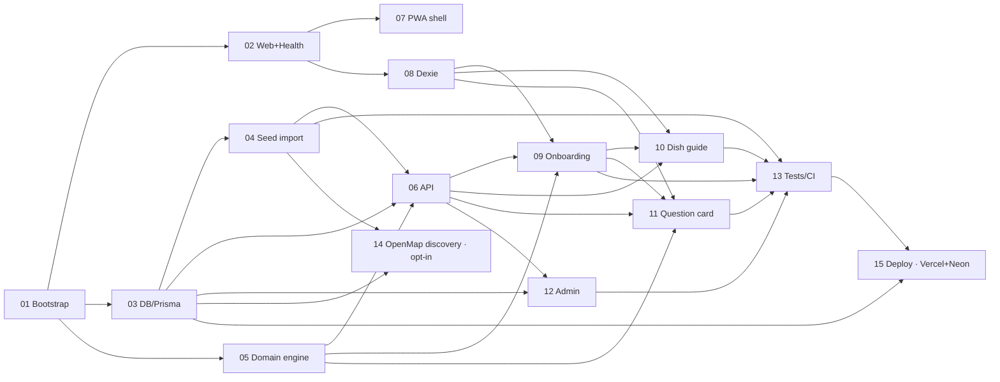

# SafeBite Travel — Phase 0 + 1 Implementation Plan

**Created:** 2026-07-08 · **Source spec:** `docs/SAFE_BITE_PHASE_0_1_IMPL_SPEC.md` · **Seed:** `osm_overpass_seed_kit/`
**Product principle:** risk *reduction*, not risk *elimination*. Never imply guaranteed safety.

## Mission & scope
Build the web/PWA foundation for an allergy-aware travel food assistant (Hanoi pilot): dish-risk guidance, local allergy/diet profile, bilingual (EN/VI) restaurant question cards, offline-first.

- **Phase 0 (engineering foundation):** monorepo, DB/Prisma, seed import, risk engine, API skeleton.
- **Phase 1 (PWA product):** app shell + offline, onboarding, allergy card, dish guide, question card, admin CRUD.
- **Not yet (Phase 2+):** native apps, Google Places/Maps, restaurant public UX, menu OCR/LLM, payment, accounts, push. (Restaurant *tables/import* exist in Phase 0; no public restaurant UI.)

## Locked decisions (see `reports/spec-gap-decisions-and-risks.md` for full ADRs)
- **ADR-001 i18n = next-intl** (overrides spec §14 dictionary): `useTranslations()` + `@/i18n/navigation`, URL locale `/en` `/vi`, messages in `apps/web/messages/*.json`. **Only static chrome** — bilingual *data* (dish names, reasons, actions, card text) stays `Record<'en'|'vi',string>`. Locale in URL ≠ profile in URL (profile stays in IndexedDB).
- **ADR-002** Monorepo built **in place** at `safe_bites/` (apps/web + packages/domain alongside existing kit + docs).
- **ADR-003** Vitest (unit) + Playwright (e2e) · **ADR-004** Serwist SW · **ADR-005** ADMIN_TOKEN → httpOnly `sbt_admin` cookie · **ADR-006** Prisma `Decimal` → `number` at the API boundary.
- **ADR-007 multi-source restaurant discovery:** OpenMap.vn joins OSM as a second discovery source feeding the SAME `Restaurant` table. Baked into phase-03 now (`openmapvn` in `SourceType` + `Restaurant.externalId`), imported by an **opt-in** `pnpm seed:openmap` in **phase-14** (additive, off the Phase-0/1 critical path). Discovery-only rails are source-agnostic (`unverified`, hidden in Phase 1); OSM↔OpenMap de-dup deferred to Phase 2.
- **ADR-008 hosting & cloud storage:** Production = **Vercel** (Next.js RSC/serverless) + **Neon** (serverless Postgres + PostGIS), co-located in **Singapore**. Prisma serverless wiring: `DATABASE_URL`=pooled (`pgbouncer=true`) + `DIRECT_URL`=direct (migrations); the `datasource` declares both — baked into phase-03. Operationalized in **phase-15** (additive, post-P0/1). Object storage (menu photos) deferred to Phase 2. Local dev still uses the Docker Postgres.

## Non-negotiable safety rails (enforced, not just documented)
Allowed statuses only: `Suitable · Ask First · Risky · Avoid · Unknown`. **Unknown must never become Suitable.** Every card shows source/confidence/reason/action/last-checked. `Suitable` always renders the caveat. Forbidden copy ("guaranteed safe", "100% safe", "allergy-proof", "this dish is safe", "verified_safe") blocked by `copy:check` CI gate. OSM restaurant data = discovery-only, `unverified`, hidden in Phase 1.

## Phases

| # | Phase | Depends on | One-line | Status |
|---|-------|-----------|----------|--------|
| 01 | [Repo bootstrap & tooling](phase-01-repo-bootstrap-and-tooling.md) | — | pnpm monorepo, tsconfig/eslint/vitest, root scripts, env, docker-compose | ✅ Done (2026-07-08) |
| 02 | [Web foundation + health](phase-02-web-app-foundation-and-health.md) | 01 | App Router + next-intl locale routing, semantic Tailwind, env/envelope, `/api/health`, landing | ✅ Done (2026-07-08) |
| 03 | [Database, Prisma & migrations](phase-03-database-prisma-schema-and-migrations.md) | 01 | All §5 enums + 9 models, PostGIS migration, db singleton, allergen-catalog seed | ✅ Done (2026-07-08) |
| 04 | [Seed-kit importer](phase-04-seed-kit-importer.md) | 03 | BOM-safe upsert profiles/ingredients/dishes/restaurants; derive allergens; 10 risk cols → DishAllergenRisk; ImportRun | ✅ Done (2026-07-08) |
| 05 | [Domain: risk engine + question card](phase-05-domain-risk-engine-and-question-card.md) | 01 | Pure `@safebite/domain`: types, Zod, deterministic engine (unknown-never-suitable), bilingual card, §8.5 tests | ✅ Done (2026-07-08) |
| 06 | [API endpoints `/api/v1`](phase-06-api-endpoints.md) | 03, 05 | 7 Zod-validated route handlers delegating to domain; envelope; Decimal→number | ✅ Done (2026-07-08) |
| 07 | [PWA shell & offline](phase-07-pwa-shell-and-offline.md) | 02 | Manifest, Serwist SW (never-cache recommendations), offline.html, app-shell chrome, `/home` | ✅ Done (2026-07-08) |
| 08 | [IndexedDB local storage (Dexie)](phase-08-indexeddb-local-storage.md) | 02 | `safebite_pwa_v1` 5 tables + save/load/delete/clear repos; do-not-store guard | ✅ Done (2026-07-08) |
| 09 | [Onboarding, profile & allergy card](phase-09-onboarding-profile-and-allergy-card.md) | 05, 06, 08 | Local-first wizard + offline allergy card + profile; honest Unknown; no profile in URL | ✅ Done (2026-07-08) |
| 10 | [Dish guide UI](phase-10-dish-guide-ui.md) | 06, 08, 09 | `/dishes` + detail; grouped status cards; EN/VI toggle; offline saved-dishes fallback | ✅ Done (2026-07-08) |
| 11 | [Question card UI](phase-11-question-card-ui.md) | 05, 06, 08, 09 | `/question-card`; target-lang toggle; large-text/fullscreen; copy; save + offline | ✅ Done (2026-07-08) |
| 12 | [Admin auth & CRUD](phase-12-admin-auth-and-crud.md) | 03, 06 | Cookie auth + composed middleware; dishes/ingredients/dish-risks CRUD; `/admin` UI | ☐ |
| 13 | [Tests, copy guard & CI](phase-13-tests-copy-guard-and-ci.md) | 04,05,06,09,10,11,12 | `assert-no-unsafe-copy`, Vitest + Playwright, CI, README, §21 DoD map | ✅ Done (2026-07-08) |
| 14 | [OpenMap restaurant discovery](phase-14-openmap-restaurant-discovery.md) | 03, 04 | **Additive / opt-in / off critical path.** `pnpm seed:openmap` maps OpenMap.vn POIs → `Restaurant` (`openmapvn`, `externalId=sid`); discovery-only; de-dup deferred to Phase 2 | ☐ (post P0/1) |
| 15 | [Deployment — Vercel + Neon](phase-15-deployment-vercel-neon.md) | 03, 13 | **Additive / post-P0/1.** Vercel app + Neon Postgres+PostGIS; pooled/direct URLs; migrate+seed on deploy; Singapore region; preview branches | ☐ (post P0/1) |

## Dependency graph



**Critical path:** `01 → 03 → 04 → 06 → 09 → 10 → 13`. Develop **05 (domain, pure TS)** in parallel with 03/04.
**Safe parallel waves:** after 01 → {02, 03, 05}; after 02 → {07, 08}; after 06+08 → {09, 10, 11, 12} (09–11 share `components/` — land the shared badge/card kit once to avoid collisions).
**Longest poles / most risk:** 04 (seed importer — R1/R2/R3/R6/R7/R8) and 05 (engine — R4 safety invariants). Front-load their unit tests.
**Off critical path (additive):** 14 (OpenMap discovery, deps 03+04, opt-in) and 15 (deploy Vercel+Neon, deps 03+13) — build after Phase-0/1 is green; both excluded from the §21 local-run DoD.

## Top risks (full register in the companion report)
R1 missing `sesame`/`soy` Allergen rows break FK → seed canonical allergen list before dishes. R2 `*_schema.csv` are data-dictionaries, not data → detect & skip. R3 utf-8-sig BOM breaks import only after a live fetch → BOM-aware parse + fixture. **R4 (critical)** unknown→suitable inversion / forbidden-copy leak → engine test + `copy:check`. R9 restaurant data leaking into Phase 1 UX / attribution dropped.

## Open questions for PO
Locale-URL strategy · exact selectable-allergen list (offer tree-nut/soy as honest Unknown?) · category/meal-type normalization · admin token hardening in deploy · offline staleness UX (show-with-warning vs hide) · confirm no persisted risk-rules table (runtime computation) · **OpenMap.vn ToS — does the plan permit DB storage + in-app display + caching, and what attribution string? (gates Phase-2 restaurant surfacing — ADR-007/R14)**. Details in the report §"Open questions".

## Run sequence (target, per spec §4.3)
```bash
pnpm install
docker compose up -d db
pnpm db:migrate && pnpm db:seed
pnpm seed:kit -- --kit ./osm_overpass_seed_kit
pnpm dev            # then pnpm test / lint / typecheck / copy:check

# optional — Phase-2 discovery (NOT part of default seed / CI; needs OpenMap ToS check):
#   export OPENMAP_API_KEY=…
#   python openmap_seed_kit/fetch_openmap_restaurants.py --out openmap_seed_kit/restaurants_openmap_live.csv
#   pnpm seed:openmap -- --file ./openmap_seed_kit/restaurants_openmap_live.csv
```

## Definition of done
Phase 0+1 complete when: app runs from README in one sequence · seed imports profiles/ingredients/dishes/generated risks · onboard without account · allergy card saved & offline · browse dish recommendations by profile · generate EN/VI question card · last card offline · admin edits dishes/ingredients/risks · every risk has source/confidence/reason/action · no forbidden copy · unit + e2e pass. (§21)
